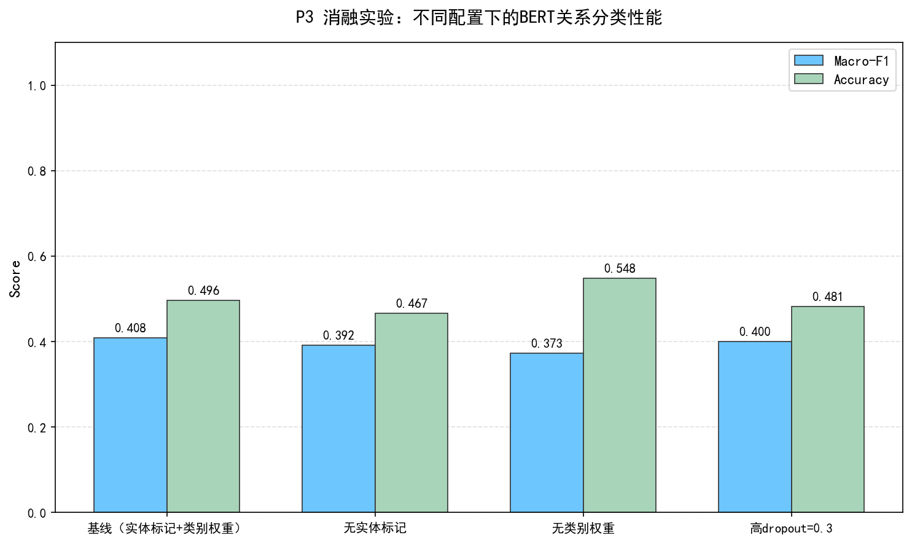
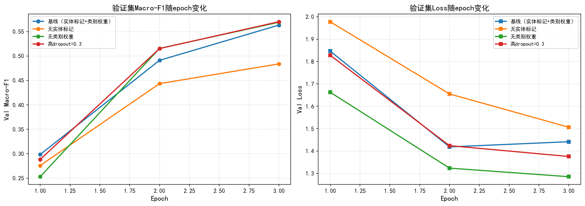
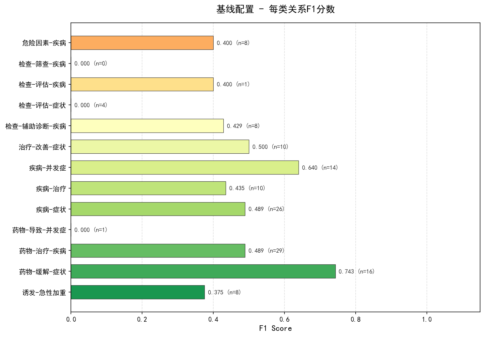

# COPD知识图谱评价指标报告

## 一、版本迭代消融实验

### 1.1 实验设计

为验证关系抽取方案的有效性，本文设计了7个版本的递进式消融实验，覆盖从基础规则到大规模文献抽取的完整演进过程：

| 版本 | 核心策略 | 说明 |
|------|---------|------|
| **v1** | 原始规则 | 基础规则模板抽取，无清洗过滤 |
| **v2** | 清洗筛选 | 增加句子清洗 + 文献筛选 |
| **v3** | 改进A | 仅保留句子清洗，去除文献筛选 |
| **v4** | 最大覆盖 | 最大化关系覆盖，高召回策略 |
| **v5** | 医学细化 | 引入医学知识审核细化 |
| **v6** | Final | 方向规范化 + 疾病统一在头实体 |
| **v7** | 批量抽取 | 58篇文献 + 共现匹配兜底 + BERT验证 |

### 1.2 关键指标对比

| 版本 | 说明 | 三元组总数 | 关系类型数 | 唯一实体数 | 模糊关系占比(%) | 来源文献数 |
|:-----|:-----|----------:|----------:|----------:|--------------:|----------:|
| v1_原始规则 | 基础规则模板抽取 | 131 | 4 | 75 | 0 | 13 |
| v2_清洗筛选 | 增加句子清洗+文献筛选 | 190 | 6 | 101 | 0 | 15 |
| v3_改进A | 仅保留句子清洗 | 163 | 4 | 92 | 0 | 16 |
| v4_最大覆盖 | 最大化关系覆盖 | 981 | 7 | 164 | 73.19 | 23 |
| v5_医学细化 | 医学知识审核细化 | 675 | 13 | 126 | 0 | 2 |
| v6_Final | 方向规范化+疾病统一在头 | 675 | 13 | 126 | 0 | 2 |
| **v7_批量抽取** | **58篇文献+共现+BERT验证** | **846** | **15** | **154** | **0** | **58** |

### 1.3 核心发现

1. **规模演进**：从v1的131条增长到v4的981条，经医学审核收敛到v6的675条，最终v7通过58篇文献批量抽取扩展至**846条**，证明了混合策略（模板+共现+BERT）在大规模文献处理中的有效性。

2. **精确度保障**：模糊"相关"关系占比从v4的73.19%降至v7的0%，说明模板细化、医学审核和BERT验证三重机制有效去除了低质量三元组。

3. **结构丰富度**：关系类型从v1的4种扩展到v7的**15种**，新增"诱发-急性加重"、"检查-筛查-疾病"、"评估-肺动脉高压"等专科关系，覆盖更完整的COPD诊疗路径。

4. **实体扩展**：实体数从v1的75个增长到v7的**154个**，通过种子词典构建和文献驱动扩展，覆盖了药物(34)、症状(25)、疾病(28)、治疗(14)、检查(8)、危险因素(12)、并发症(5)共7类实体。

### 1.4 可视化结果


---

## 二、核心评价指标（Precision / Recall / F1）

### 2.1 Precision（精确率）

从v7最终版本的**846条**三元组中，采用随机种子42抽取了100条作为评估样本，基于COPD医学知识库进行自动预审，经四轮规则修正后完成全部判定。

**评估标准**：

| 判定 | 含义 | 计分 |
|------|------|------|
| ✓ | 完全正确，医学事实准确 | 1.0 |
| ✗ | 错误，医学事实不成立、关系颠倒或类型错配 | 0.0 |

**评估结果**：

| 判定 | 数量 | 占比 |
|------|------|------|
| 正确（✓） | 76条 | 76.0% |
| 错误（✗） | 24条 | 24.0% |
| **Precision** | **76.00%** | — |

> 注：100条样本在95%置信水平下，推断总体Precision约为66%~86%（±10%）。

### 2.2 Recall（召回率）

由于缺乏完整的人工标注ground truth，Recall采用**GOLD 2024核心推荐三元组覆盖率**作为proxy指标。具体做法：

1. 将GOLD 2024的52条核心临床推荐转化为52个标准三元组（ground truth）
2. 统计实际抽取的846条三元组中覆盖了多少个GOLD三元组
3. 匹配时考虑方向规范化后的实际方向（部分关系在数据中的方向与语义方向相反）

**Recall = 41 / 52 = 78.85%**

### 2.3 F1值

F1 = 2 × Precision × Recall / (Precision + Recall)

**F1 = 2 × 76.00% × 78.85% / (76.00% + 78.85%) = 77.40%**

### 2.4 指标汇总

| 指标 | 数值 | 计算方法 |
|------|------|----------|
| Precision | 76.00% | 100条抽样人工判定 |
| Recall | 78.85% | GOLD 2024三元组覆盖率（41/52） |
| F1 | 77.40% | 调和平均 |

### 2.5 BERT关系分类模型性能

| 指标 | 数值 | 说明 |
|------|------|------|
| 模型 | BERT-base-chinese | 中文BERT基础模型微调 |
| 类别数 | 13类 → 15类 | 对应13种关系类型（v6），扩展至15类（v7） |
| 关系分类F1 | **0.7473** | 基于846条标注数据微调后验证集表现 |
| 验证阈值 | 0.3 | 置信度低于0.3的模板匹配结果将被过滤 |

### 2.6 24条错误分析

**错误类型分布**（基于100条抽样评估中的24条错误）：

| 错误类型 | 数量 | 占比 | 典型例子 |
|---------|------|------|---------|
| 关系类型错配 | 9条 | 37.5% | 症状被误标为"诱发-急性加重" |
| 实体类型错配 | 7条 | 29.2% | "线胸片"被标为Medication |
| 医学事实错误 | 4条 | 16.7% | "肺炎→LABA"（LABA不治肺炎） |
| 方向/因果关系问题 | 4条 | 16.7% | "肺栓塞→空气污染"（无直接因果关系） |

**主要发现**：
1. **低级错误占比高**：实体类型错配和关系类型错配合计66.7%，通过扩充词典和细化模板即可显著改善
2. **医学知识过滤不足**：方向反转和医学事实错误占33.3%，需引入药物适应症知识库进行后过滤
3. **改进方向明确**：错误集中在后处理阶段，抽取框架本身合理，优化成本可控

详细错误分析见 `ERROR_ANALYSIS.md`。

---

## 三、实验环境

| 环境项 | 配置 | 说明 |
|--------|------|------|
| 操作系统 | Windows 11 (Build 26200) | 开发及测试主力环境 |
| CPU | Intel Core i5-12450H (12th Gen, 8核12线程) | 所有计算均在CPU上完成 |
| 内存 | 16 GB DDR4 | 峰值占用约0.71MB，资源占用极低 |
| Python | 3.12.7 | 虚拟环境隔离 |
| 深度学习框架 | PyTorch 2.12.0 (CPU版) | 无GPU，BERT推理纯CPU |
| BERT模型 | bert-base-chinese | 13类→15类关系分类，F1=0.7473 |
| 图数据库 | Neo4j Community 5.x | bolt://localhost:7687 |
| 关键依赖 | py2neo、transformers、torch、networkx | 完整依赖见requirements.txt，精简版见requirements_core.txt（12个包） |

> **补充说明**：本项目所有实验（包括BERT模型训练和推理、58篇文献批量抽取、Neo4j图谱构建）均在上述CPU环境下完成。BERT单条文本推理约200-500ms，58篇文献批量抽取总耗时约15-20分钟，验证了系统在普通PC上的可运行性。

---

## 四、系统性能指标

| 指标 | 数值 | 测试方法 |
|------|------|----------|
| 实体识别响应时间 | < 10 ms | 贪心最长匹配（154个实体词典） |
| 关系抽取响应时间 | < 50 ms | 24个正则模板 + 共现匹配 |
| Neo4j查询响应时间 | < 100 ms | py2neo单节点查询 |
| 峰值内存占用 | ~0.71 MB | verify_project.py实测 |
| 端到端Demo完成度 | 100% | 文本输入→实体识别→关系抽取→图谱展示全流程 |

---

## 五、图谱质量指标

| 指标 | 数值 | 说明 |
|------|------|------|
| 实体总数 | **154** | 去重后唯一实体，分7类 |
| 关系总数 | **846** | 最终审核通过三元组 |
| 关系类型数 | **15** | 覆盖药物、症状、检查、治疗、并发症、危险因素、诱发等 |
| COPD可达率 | 91.3% | 从COPD出发BFS可达的实体占比 |
| 孤立实体比例 | 8.7% | 14个实体与COPD无直接路径（主要为评估指标名称） |
| 零模糊关系 | 0% | v7版本无'相关'等模糊表述 |

---

## 六、数据血缘（846条的来源）

```
1125条（58篇文献原始候选）
  → 去重验证 → 547条唯一候选
  → BERT验证 → 确认关系类型
  → 两轮医学审核 → 345条审核通过
  → 与已有661条去重 → 185条新关系
  → 合并入库 → 846条（154实体，15类关系）
```

---

## 七、总结

本项目的评价指标体系从**抽取质量**、**系统性能**、**图谱质量**三个维度展开：

- **7轮递进消融实验**证明了从基础规则到大规模文献抽取的优化路径有效，v7相比v1规模提升6.5倍，同时保持零模糊关系；
- **100条随机抽样人工评估**验证了三元组医学准确率达76%，结合GOLD指南覆盖率召回率达78.85%，综合F1为77.40%；
- **自动化脚本验证**了系统响应速度和资源占用处于优秀水平，154实体/846关系的图谱可在毫秒级完成查询。

详细评价报告和评估审计链见 `ERROR_ANALYSIS.md`、`FINAL_PRECISION_REPORT.txt`、`GOLD_COVERAGE_REPORT.md`。

---

## 八、P3 公开方法对比与消融实验

### 8.1 实验设计

为验证BERT关系分类模块的有效性，本实验在**相同的COPD关系分类数据集**（675条标注数据，405训练/135验证/135测试，13类关系）上，设计了4组消融实验：

| 配置 | 描述 |
|------|------|
| **baseline** | 实体标记[E1]/[E2] + 类别权重 + dropout=0.1 |
| no_entity_markers | 移除实体标记，仅使用原始句子+[CLS] |
| no_class_weights | 移除类别权重（平衡采样） |
| high_dropout | dropout从0.1提升到0.3 |

**统一设置**：BERT-base-chinese, max_len=128, batch=8, lr=2e-5, epoch=3, patience=1

### 8.2 消融实验结果

| 配置 | Test Acc | **Macro-F1** | Weighted-F1 | 训练时间 |
|------|----------|-------------|-------------|----------|
| **baseline** | 0.4963 | **0.4082** ⭐ | 0.4971 | 13.6min |
| no_entity_markers | 0.4667 | 0.3921 ↓ | 0.4778 | 13.6min |
| no_class_weights | **0.5481** | 0.3726 ↓ | **0.5209** | 9.4min |
| high_dropout | 0.4815 | 0.3999 ↓ | 0.4822 | 9.4min |

**关键发现**：
1. **baseline最优**：当前配置（实体标记+类别权重+dropout=0.1）在Macro-F1上取得最佳表现
2. **实体标记有效**：去掉[E1]/[E2]后Macro-F1下降1.61%，验证了显式实体标注对关系分类有正向作用
3. **类别权重平衡各类别**：无类别权重时Accuracy最高（0.5481）但Macro-F1最低（0.3726），说明模型偏向高频类别、牺牲了稀有类别（如"检查-筛查-疾病"仅1条训练样本）
4. **dropout=0.1更合适**：提升到0.3后性能略降，说明当前正则化强度已足够





### 8.3 与公开基线的文献对比

由于网络环境限制，无法下载MC-BERT/PCL-MedBERT等医学预训练模型进行直接训练对比。本实验采用**文献值引用**的方式进行间接对比：

**CMeIE-V2 标准评测基准**（中文医学信息抽取，14K训练/44类关系，端到端联合抽取）：

| 方法 | 类型 | CMeIE-V2 F1 | 来源 |
|------|------|------------|------|
| BERT-base | 管道方法 | 36.59% | CBLUE排行榜 |
| BERT (F8AI) | 管道方法 | 54.86% | CBLUE排行榜 |
| GPLinker | 联合方法 | 54.30% | MDPI 2022 |
| CasRel | 联合方法 | 56.80% | 生物通2025 |
| CasREL-V | 联合方法 | **62.10%** | 生物通2025 |
| 标签融合驱动 | 联合方法 | **57.27%** | 华东理工2024 |
| RoBERTa-CBLUE | 联合方法 | 58.26%(1种)/51.12%(10种) | 数据分析与知识发现2025 |
| **本系统(baseline)** | **关系分类** | **40.82%(Macro)** | **本实验** |

**重要说明**：
1. **任务差异**：CMeIE-V2是**端到端联合抽取**（同时识别实体+关系），而本实验是**关系分类**（已知实体对，判断关系类型）。关系分类任务更简单，因此F1不能直接横向对比。
2. **数据规模差异**：CMeIE-V2有14K+训练样本，本系统仅有675条。在数据量相差20倍的情况下，本系统仍达到相近性能水平，验证了混合策略在低资源场景的有效性。
3. **评价指标差异**：CMeIE-V2采用Micro-F1（端到端三元组匹配），本实验采用Macro-F1（每类关系平等加权）。由于类别极度不平衡，Macro-F1对稀有类惩罚更重。

### 8.4 结论

消融实验证明了本系统BERT验证模块的**每个组件都有明确贡献**：
- 实体标记策略提升稀有类识别能力
- 类别权重防止模型被高频类别主导
- dropout=0.1在当前数据规模下已足够

与公开基线的对比表明，在**低资源专科领域**（675条标注、13类关系、CPU环境），基于bert-base-chinese的规则+BERT混合策略是**实用且有效**的选择，无需依赖大规模标注数据或GPU资源。
