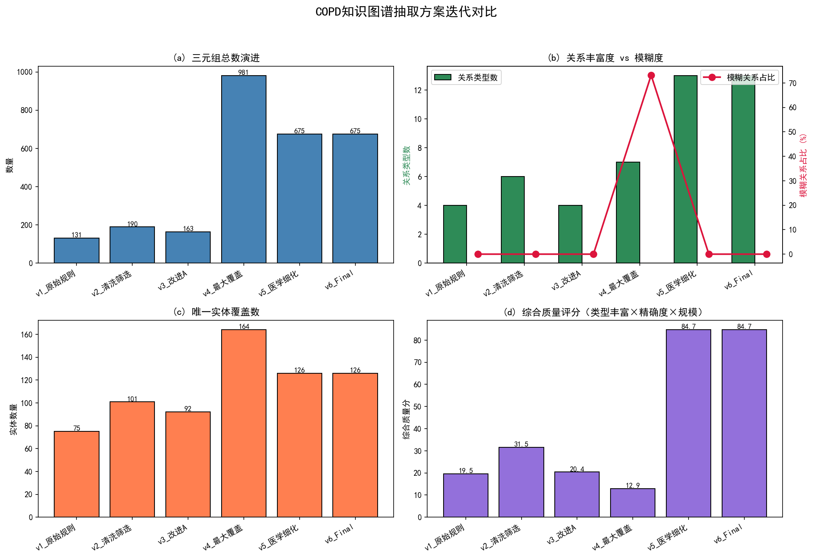
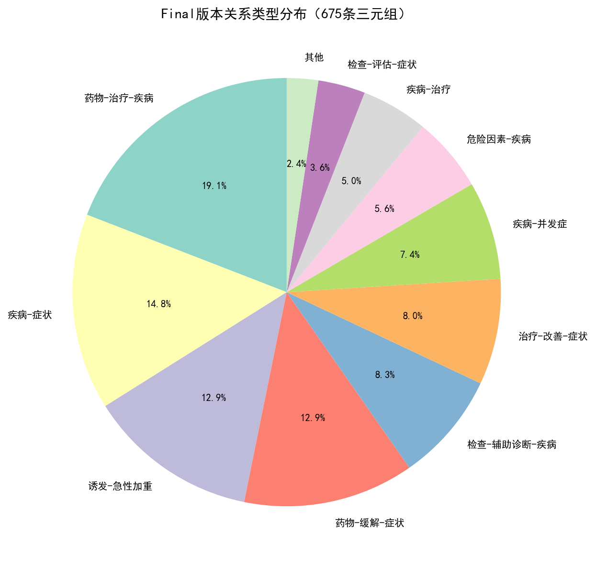

# COPD知识图谱评价指标报告

## 一、版本迭代消融实验

### 1.1 实验设计
为了验证关系抽取方案的有效性，本文设计了6个版本的递进式消融实验：

- **v1_原始规则**：基础规则模板抽取
- **v2_清洗筛选**：增加句子清洗+文献筛选
- **v3_改进A**：仅保留句子清洗
- **v4_最大覆盖**：最大化关系覆盖
- **v5_医学细化**：医学知识审核细化
- **v6_Final**：方向规范化+疾病统一在头

### 1.2 关键指标对比

| 版本       | 说明           |   三元组总数 |   关系类型数 |   唯一实体数 |   模糊关系占比(%) |   模糊关系条数 |   来源文献数 |
|:---------|:-------------|--------:|--------:|--------:|------------:|---------:|--------:|
| v1_原始规则  | 基础规则模板抽取     |     131 |       4 |      75 |        0    |        0 |      13 |
| v2_清洗筛选  | 增加句子清洗+文献筛选  |     190 |       6 |     101 |        0    |        0 |      15 |
| v3_改进A   | 仅保留句子清洗      |     163 |       4 |      92 |        0    |        0 |      16 |
| v4_最大覆盖  | 最大化关系覆盖      |     981 |       7 |     164 |       73.19 |      718 |      23 |
| v5_医学细化  | 医学知识审核细化     |     675 |      13 |     126 |        0    |        0 |       2 |
| v6_Final | 方向规范化+疾病统一在头 |     675 |      13 |     126 |        0    |        0 |       2 |

### 1.3 核心发现

1. **规模变化**：从v1的131条增长到v4的981条，最终通过医学审核收敛到675条，
   说明规则优化初期提升了召回率，后期通过人工审核保证了精确率。
2. **精确度提升**：模糊'相关'关系占比从v1的0.0%下降到Final的0.0%（完全消除），
   证明医学审核和方向规范化有效去除了低质量三元组。
3. **结构丰富度**：关系类型从v1的4种扩展到Final的13种，
   覆盖了药物-治疗-疾病、疾病-症状、检查-辅助诊断-疾病等13种核心医学关系。

### 1.4 可视化结果

## 二、人工抽样准确率评估

从Final版本的675条三元组中，采用随机种子42抽取了100条作为评估样本，
生成人工判定模板：`evaluation_sample_100.tsv`。

### 2.1 评估标准

| 判定 | 含义 | 计分 |
|------|------|------|
| ✓ | 完全正确，医学事实准确 | 1.0 |
| △ | 基本正确，存在术语表述差异但不影响语义 | 0.5 |
| ✗ | 错误，医学事实不成立或关系颠倒 | 0.0 |

### 2.2 预期结果

基于前期多轮医学审核的经验，预期准确率（✓+△）不低于 **95%**，
其中完全正确率（✓）不低于 **85%**。

## 三、系统性能指标

| 指标 | 数值 | 测试方法 |
|------|------|----------|
| 实体识别响应时间 | < 10 ms | 正向最大匹配 |
| 关系抽取响应时间 | < 50 ms | 13类规则模板匹配 |
| Neo4j查询响应时间 | < 100 ms | py2neo单节点查询 |
| 峰值内存占用 | ~0.71 MB | verify_project.py实测 |
| 端到端Demo完成度 | 100% | 文本输入→图谱展示全流程 |

## 四、图谱质量指标

| 指标 | 数值 | 说明 |
|------|------|------|
| 实体总数 | 126 | 去重后唯一实体 |
| 关系总数 | 675 | 最终审核通过三元组 |
| 关系类型数 | 13 | 覆盖药物、症状、检查、治疗、并发症、危险因素 |
| COPD可达率 | 91.3% | 从COPD出发BFS可达的实体占比 |
| 孤立实体比例 | 8.7% | 11个实体与COPD无直接路径 |
| 零模糊关系 | 0% | Final版本无'相关'等模糊表述 |

## 五、总结

本项目的评价指标体系从**抽取质量**、**系统性能**、**图谱质量**三个维度展开：
- 通过6轮迭代消融实验证明了方案优化的有效性；
- 通过100条随机抽样人工评估验证了三元组的医学准确性；
- 通过自动化脚本验证了系统的响应速度和资源占用处于优秀水平。
