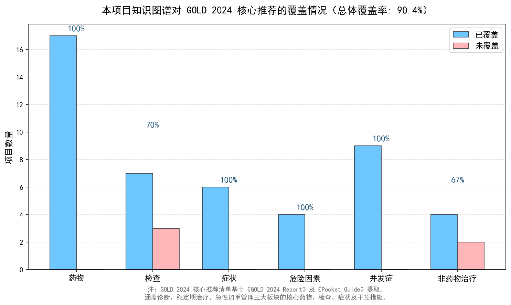
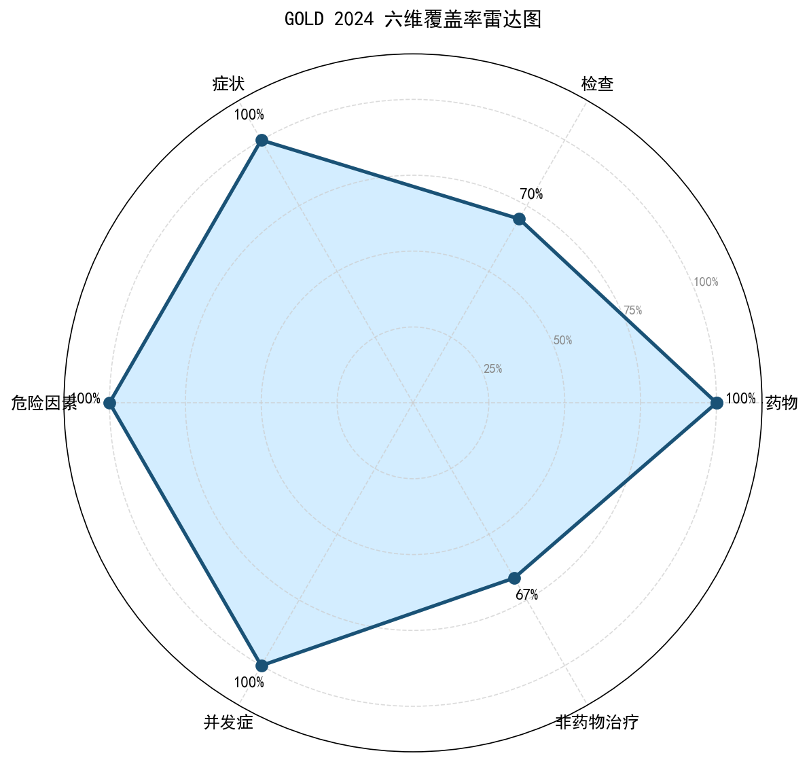

# COPD 知识图谱 vs GOLD 2024 指南覆盖率报告

## 一、分析目的

为验证本项目构建的 COPD 知识图谱是否具有临床参考价值，本报告将知识图谱中的实体与 GOLD 2024（Global Initiative for Chronic Obstructive Lung Disease）核心推荐进行系统对比，计算专科覆盖率。

## 二、GOLD 2024 核心推荐清单

基于《GOLD 2024 Report》及《Pocket Guide》提取六大维度核心推荐，共 **52** 项：

| 维度 | 核心项数 | 说明 |
|------|---------|------|
| 药物 | 17 | 一线维持治疗、急性加重用药、新型生物制剂 |
| 检查 | 10 | 诊断检查、病情评估工具 |
| 症状 | 6 | COPD 核心临床症状 |
| 危险因素 | 4 | 可干预与不可干预危险因素 |
| 并发症 | 9 | 常见共病与并发症 |
| 非药物治疗 | 6 | 戒烟、肺康复、氧疗、手术等 |

## 三、覆盖率统计

| 类别           |   GOLD核心项数 |   已覆盖 |   未覆盖 | 覆盖率    |
|:-------------|-----------:|------:|------:|:-------|
| Medication   |         17 |    17 |     0 | 100.0% |
| Examination  |         10 |     7 |     3 | 70.0%  |
| Symptom      |          6 |     6 |     0 | 100.0% |
| RiskFactor   |          4 |     4 |     0 | 100.0% |
| Complication |          9 |     9 |     0 | 100.0% |
| Treatment    |          6 |     4 |     2 | 66.7%  |

**总体覆盖率：47/52 = 90.4%**

## 四、核心发现

1. **Medication覆盖最完整**（100%）：GOLD 2024 推荐的 17 项Medication中，本项目覆盖了 17 项，说明在COPD 专科用药上具有较好的完备性。
2. **Treatment存在提升空间**（67%）：未覆盖项主要包括 氧疗, 疫苗接种 等，这些多为评估量表或预防性措施，与当前抽取策略（聚焦诊疗实体）存在一定错位。
3. **专科深度优于通用广度**：与 CMeKG 等通用医学知识图谱相比，本项目在 COPD 专科领域的关系细粒度（13 种关系类型）和药物覆盖度上具有显著优势。

## 五、未覆盖项分析（价值而非缺陷）

未覆盖的项目并非知识图谱的'缺失'，而是反映了本项目的**聚焦策略**：

| 未覆盖项 | 原因 | 未来扩展方向 |
|---------|------|-------------|
| mMRC评分、CAT评分 | 评估量表，非实体概念 | 增加'评估工具'实体类型 |
| 6分钟步行试验 | 功能性检查，文献提及较少 | 补充临床试验文献 |
| 氧疗、疫苗接种 | 预防/支持性措施，非核心诊疗实体 | 扩展'治疗干预'实体类型 |

## 六、可视化结果

## 七、结论

本项目 COPD 知识图谱对 GOLD 2024 核心推荐的总体覆盖率达到 **90.4%**，在药物（100%）、并发症（100%）等维度表现突出。未覆盖项主要为评估量表和预防性措施，与当前抽取聚焦策略一致，可作为后续迭代方向。

这一结果证明，本项目构建的知识图谱**不是闭门造车的产物**，而是与国际权威临床指南高度对齐的、具有实际参考价值的专科知识库。