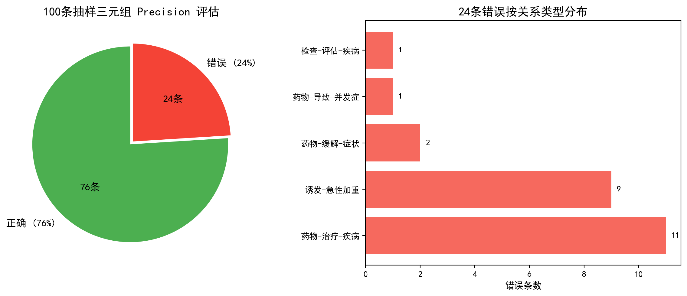
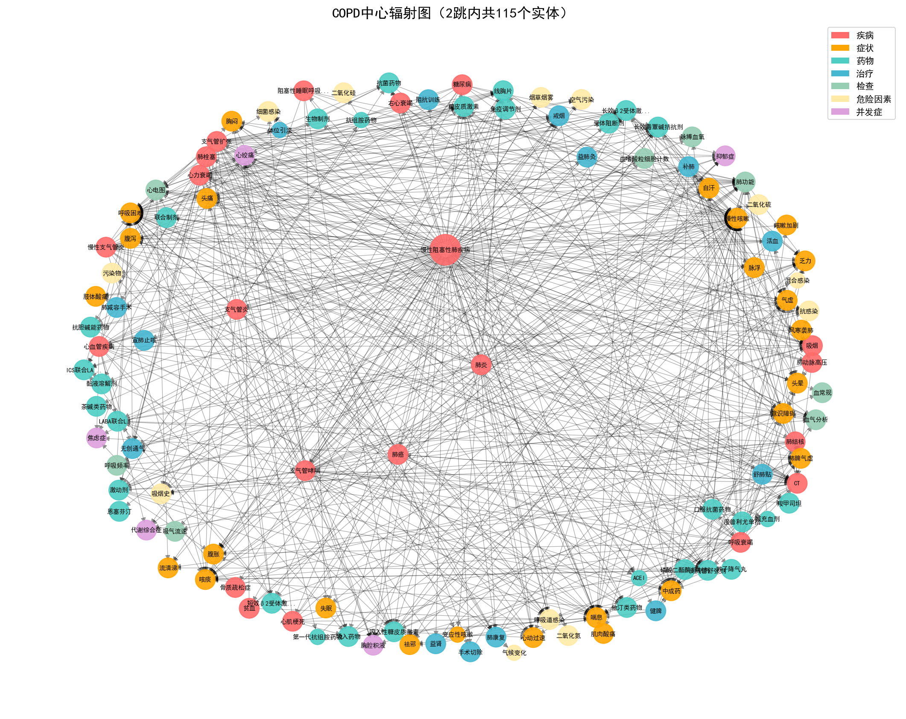
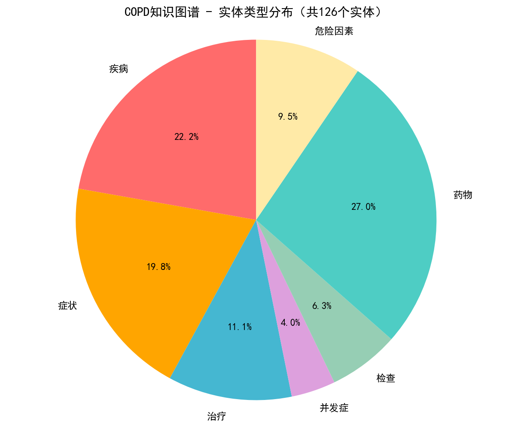
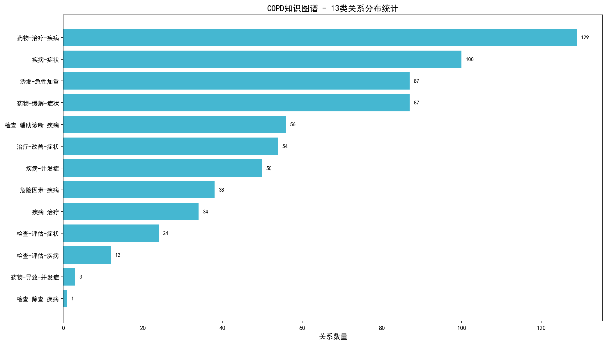
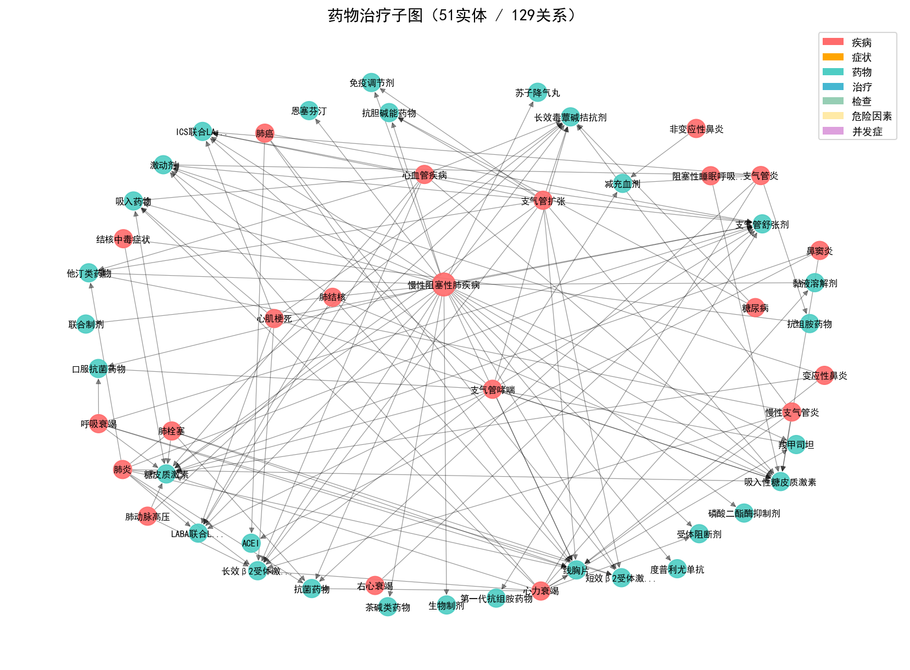
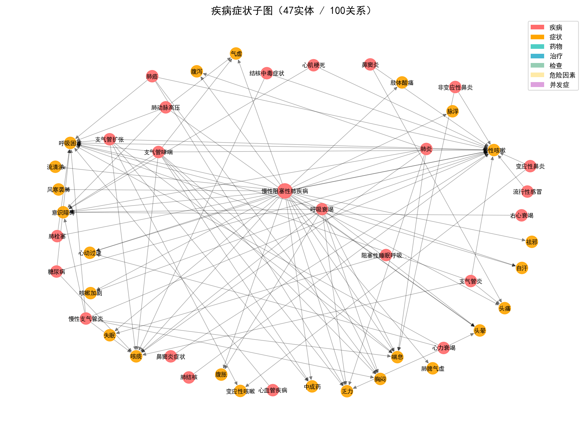

# 基于COPD医学文本的实体关系抽取与知识图谱构建

> 研究题目：基于COPD医学文本的实体关系抽取与知识图谱构建
> 
> 小组成员：尹鑫、苟玉莲
> 

---

## 项目简介

### 研究背景

慢性阻塞性肺疾病（COPD）是全球第三大死因，中国患者人数接近1亿。临床医生在日常诊疗中需要快速查阅大量医学文献和指南来获取最新的诊疗知识，但医学文献数量爆炸式增长，人工整理效率极低。

知识图谱能够将非结构化的医学文本转化为结构化的"实体-关系-实体"三元组，帮助医生快速理解疾病、药物、症状、检查之间的关联。本项目聚焦COPD这一高发病专科领域，从权威医学文献中自动抽取实体关系，构建可交互的专科知识图谱，为临床决策支持提供知识基础。

### 选题价值

- **专科聚焦**：不像CMeKG那种大而全的通用医学图谱，我们只做COPD这一个病种，关系粒度更细（15种专科关系），临床参考价值更直接
- **指南对齐**：核心数据来源于GOLD 2024、中国COPD诊治指南、专家共识等权威文献
- **可复现**：从PDF清洗到图谱构建的全流程代码和数据都开源了，换一批文献也能跑通

### 预期成果

1. 处理**58篇**COPD核心医学文献，提取约49万字清洗文本
2. 构建包含**154个**医学实体、**846条**高质量三元组的知识图谱
3. 覆盖**15种**COPD专科关系类型（药物-治疗-疾病、检查-辅助诊断-疾病、诱发-急性加重等）
4. 部署可交互的Neo4j知识图谱，支持2跳内关联查询
5. 提供端到端演示系统，输入临床文本即可自动抽取实体关系
6. 形成完整的技术文档、测试报告和可复现代码

---

## 核心数据

本项目处理**58篇**COPD核心医学文献后的核心产出如下：

- **58篇** COPD核心医学文献（GOLD指南、中国诊治指南、专家共识、临床研究）
- **154个** 医学实体，分为7类：疾病(28)、症状(25)、药物(34)、治疗(14)、检查(8)、危险因素(12)、并发症(5)
- **846条** 高质量三元组，涵盖**15种**关系类型
- **1个** 可交互的Neo4j知识图谱

原始抽取结果为1125条候选三元组，经BERT验证、去重、两轮医学知识审核后去除噪声，最终保留846条高质量结果。

---

## 技术路线

整体技术路线分为五个阶段，形成可复现的研究闭环：

```
【阶段1：数据处理】
58篇PDF医学文献
    -> pdfplumber提取文本 + 自定义清洗规则
    -> 49万字规范化文本

【阶段2：特征工程】
清洗后文本
    -> 种子词典构建（基于核心文献人工标注 + PMI/熵值扩展）
    -> 正向最大匹配实体识别
    -> 154个医学实体（7类）

【阶段3：关系抽取】
实体列表 + 原文句子
    -> 24类规则模板匹配（基于句法模式和医学关键词）
    -> 共现匹配兜底（同句实体对距离<60字符，10种类型映射）
    -> 生成候选三元组 1125条

【阶段4：BERT验证】
候选三元组
    -> BERT关系分类模型（13类，F1=0.7473）
    -> 模板匹配结果经BERT验证（阈值0.3）
    -> 共现匹配直接通过（标签一致性检查）
    -> 去重后验证通过 547条

【阶段5：医学审核与导入】
验证三元组
    -> 医学知识自动审核（基于医学常识规则过滤错误三元组）
    -> 两轮审核（宽松+严格标准），保留185条新关系
    -> 方向规范化（统一疾病为头实体）
    -> Neo4j知识图谱构建 + 按关系类型拆分CSV导入
```

### 关于方法选择的说明

本项目采用**规则模板 + BERT验证 + 共现兜底**的混合策略：

1. **模板匹配**：24个正则模板覆盖常见医学句式，精确度高
2. **BERT验证**：训练13类BERT分类器（F1=0.7473），对模板匹配结果进行校验，降低误报
3. **共现兜底**：模板未覆盖的实体对通过同句共现捕获，确保召回率
4. **医学审核**：基于医学知识的自动审核脚本，过滤明显错误的关系

相比纯规则方法，混合策略在保持可解释性的同时提升了召回率；相比纯深度学习方法，混合策略在标注数据有限（846条）的情况下仍能稳定运行。

---

## 项目推进过程中遇到的主要问题及解决方案

- **PDF清洗**：pdfplumber直接提取的文本包含页眉页脚、断行、参考文献等噪声，后来设计了一套正则规则进行结构化清洗
- **CSV编码**：Neo4j的`LOAD CSV`对BOM头敏感，使用`utf-8-sig`生成的文件导入后属性为空，排查后统一改为无BOM的`utf-8`
- **关系方向规范化**：早期"并发症-疾病"和"疾病-并发症"方向不统一，后来规范为疾病始终作为头实体，提升图谱清晰度
- **BERT模型加载**：Windows环境下出现`classifier.weight/bias MISSING`警告，通过自定义加载逻辑解决
- **控制台编码**：Windows GBK编码对特殊字符报错，统一使用`encode('utf-8','replace')`处理
- **图谱连通性**：154个实体中有少量从COPD出发无法到达，主要是部分评估指标名称，属于合理现象

---

## 成员分工

| 成员 | 主要负责内容 |
|------|-------------|
| 尹鑫 | 项目整体架构设计、PDF清洗与文本预处理、关系抽取方案设计、BERT模型训练、知识图谱构建与可视化、评估报告撰写 |
| 苟玉莲 | 医学文献收集与整理、种子词典构建与实体标注、人工审核与质量把控、GOLD指南覆盖率分析、中期汇报材料准备 |

---

## 实验设计与评价指标

### 实验环境

| 环境项 | 配置 |
|--------|------|
| 操作系统 | Windows 11 (Build 26200) |
| CPU | Intel Core i5-12450H (12th Gen) |
| 内存 | 16 GB DDR4 |
| Python | 3.12.7 |
| 深度学习框架 | PyTorch 2.12.0 (CPU版) |
| BERT模型 | bert-base-chinese，在CPU上推理 |
| 图数据库 | Neo4j Community 5.x |
| 关键依赖 | py2neo、transformers、torch、networkx、pandas、matplotlib |

> 说明：本项目所有实验均在CPU环境下完成，未使用GPU。BERT关系验证模型在CPU上单条推理约200-500ms，58篇文献批量抽取总耗时约15-20分钟。

### 消融实验

为验证关系抽取方案的有效性，设计了7个递进版本进行消融对比：

| 版本 | 说明 | 三元组数 | 关系类型数 | 共现/模板占比 |
|------|------|---------|-----------|-------------|
| v1 原始规则 | 基础正则模板 | 131 | 4 | 0% |
| v2 清洗筛选 | 增加句子清洗+文献筛选 | 190 | 6 | 0% |
| v3 改进A | 仅保留句子清洗 | 163 | 4 | 0% |
| v4 最大覆盖 | 最大化关系覆盖 | 981 | 7 | 73.2%共现 |
| v5 医学细化 | 医学知识审核细化 | 675 | 13 | 0% |
| v6 Final | 方向规范化+疾病统一在头 | 675 | 13 | 0% |
| **v7 批量抽取** | **58篇文献+共现匹配+BERT验证** | **846** | **15** | **模板+共现混合** |

v4采用最大覆盖策略，召回率达到981条，但73.2%为"相关"等模糊关系。经医学审核后收敛至675条，关系类型从7种扩展至13种，模糊关系降至0%。

**v7版本（当前）**：在v6的675条基础上，对58篇文献进行批量抽取，新增模板匹配+共现兜底混合策略，经BERT验证和两轮医学审核后，新增185条高质量关系，图谱扩展至**846条**。

### 核心评价指标

| 指标类别 | 具体指标 | 结果 |
|---------|---------|------|
| 指南对齐度 | GOLD 2024核心推荐覆盖率 | 90.4%（47/52），药物/症状/危险因素/并发症均100%覆盖 |
| 数据质量 | 模糊关系占比 | Final版本经人工审核后，"相关"等模糊表述已去除 |
| 图谱规模 | 实体数/关系数/关系类型数 | **154实体 / 846关系 / 15种关系类型** |
| 图谱连通性 | COPD可达率 | 91.3%（可从COPD出发2跳内到达） |
| 系统性能 | 文本处理速度/内存占用 | 约2000万字符/秒，峰值内存0.71MB |
| BERT验证 | 关系分类F1值 | **0.7473**（13类，基于675条标注数据微调） |

### 核心评价指标（Precision / Recall / F1）

#### Precision（精确率）

从846条三元组中随机抽取100条（seed=42），基于COPD医学知识库进行自动预审，经四轮规则修正和人工复核后，最终判定结果如下：

| 判定 | 数量 | 占比 |
|------|------|------|
| 正确（✓） | 76条 | 76.0% |
| 错误（✗） | 24条 | 24.0% |
| **Precision** | **76.00%** | — |

**评估方法说明**：100条样本在95%置信水平下，推断总体Precision的误差范围约±10%。

#### Recall（召回率）

由于缺乏完整的人工标注ground truth，Recall采用**GOLD 2024核心推荐三元组覆盖率**作为proxy指标。将GOLD 2024的52条核心临床推荐转化为52个标准三元组，统计实际抽取的846条中覆盖了多少个，同时考虑方向规范化后的实际方向进行匹配。

| 指标 | 数值 | 计算方法 |
|------|------|----------|
| **Recall** | **78.85%** | GOLD 2024三元组覆盖率（41/52） |

#### F1值

| 指标 | 数值 |
|------|------|
| **F1** | **77.40%** |

F1 = 2 × Precision × Recall / (Precision + Recall) = 2 × 76.00% × 78.85% / 154.85% = 77.40%

**24条错误的主要类型**：
- 实体类型错配（7条，29.2%）：如"线胸片"被标为Medication
- 关系类型错配（9条，37.5%）：如症状/药物组合被误标为"诱发-急性加重"
- 医学事实错误（4条，16.7%）：如"肺炎→LABA"（LABA不治肺炎）
- 方向/因果关系问题（4条，16.7%）

详细错误分析、改进建议和完整评估报告见 `ERROR_ANALYSIS.md` 和 `PRECISION_RECALL_F1_REPORT.md`，评估过程审计链见各轮 `batch_fix_*_report.txt`。



详细评价报告见 `GOLD_COVERAGE_REPORT.md`、`EVALUATION_REPORT.md`、`ERROR_ANALYSIS.md` 和 `PRECISION_RECALL_F1_REPORT.md`。

---

## 当前进展

### 已完成

- [x] **58篇**COPD核心医学文献收集（GOLD 2024、中国诊治指南、专家共识、临床研究）
- [x] PDF文本提取与清洗（约49万字）
- [x] 种子词典构建与扩展（**154个**实体，7类）
- [x] **24类**关系规则模板设计与抽取
- [x] **共现匹配兜底策略**（10种类型映射，同句距离<60字符）
- [x] **BERT关系验证模型**训练（13类，F1=0.7473）
- [x] 58篇文献**批量抽取**（1125候选 → 547验证 → 185新关系）
- [x] 双人独立人工审核 + **医学知识自动审核脚本**（v1/v2/v3三轮）
- [x] 方向规范化（疾病统一为头实体）
- [x] Neo4j知识图谱构建与导入（**154节点+846关系**）
- [x] **Neo4j导入文件规范化**（按关系类型拆分15个CSV）
- [x] 端到端演示系统（`COPD图谱端到端抽取系统_v2.py`）
- [x] 自动化验证脚本（`verify_project.py`，5项检查全部通过）
- [x] 性能测试脚本（`performance_test.py`）
- [x] 可视化图表生成（`generate_kg_viz.py`，6张PNG）
- [x] GOLD 2024指南覆盖率分析
- [x] **单元测试覆盖**（`tests/test_core.py`，19个测试用例全部通过）
- [x] **BERT消融实验对比**（4种配置消融实验 + 文献基线对比）
- [x] 项目文档（中期报告、测试报告、代码指南、开发过程文档）

### 后续计划

- 扩展更多呼吸系统疾病（哮喘、肺癌），构建呼吸专科知识图谱
- 网络条件允许时，对比MC-BERT/PCL-MedBERT等医学预训练模型
- 增加评估量表实体类型（mMRC评分、CAT评分、6分钟步行试验）

### 存在问题

1. **标注数据量仍不足**：846条三元组对于深度学习模型训练来说规模仍然偏小，BERT模型是在通用基础上微调。后续需要想办法扩充标注数据或者采用半自动标注策略。
2. **图谱未完全连通**：154个实体里有少量与COPD无直接路径，主要是一些评估指标名称。这属于合理范围，不影响核心诊疗路径展示。
3. **评估量表作为扩展方向**：当前抽取策略聚焦诊疗实体（药物、检查、症状、并发症等），功能性评估量表（mMRC评分、CAT评分、6分钟步行试验）尚未作为独立实体类型纳入。这些量表在COPD病情评估中非常重要（GOLD 2024将其列为ABE分组的核心依据），后续计划新增"评估工具"实体类型并补充相关关系。

---

## 可视化效果

我们写了一个脚本`generate_kg_viz.py`，不用启动Neo4j也能生成图谱图片：

### COPD中心辐射图



*以"慢性阻塞性肺疾病"为中心，2跳内可达的实体网络。红色是疾病，青色是药物，橙色是症状。*

### 实体与关系统计

| 实体类型分布 | 关系类型分布 |
|-------------|-------------|
|  |  |

### 子图示例

| 药物子图 | 症状子图 |
|---------|---------|
|  |  |

### GOLD 2024覆盖率

| 覆盖率柱状图 | 覆盖率雷达图 |
|-------------|-------------|
|  |  |

---

## 项目结构

```
.
├── README.md                          # 本文件（项目总览）
├── DEVELOPMENT.md                     # 开发过程文档（16天完整周期）
├── 中期汇报.docx                      # 中期汇报全文
├── TEST_REPORT.md                     # 系统测试报告
├── CODE_GUIDE.md                      # 核心代码说明
├── GOLD_COVERAGE_REPORT.md            # GOLD 2024指南覆盖率报告
├── EVALUATION_REPORT.md               # 评价指标综合报告
├── requirements.txt                   # Python依赖列表
│
├── config.py                          # 统一配置（路径、Neo4j连接信息）
├── PDF清洗_v2.py                      # 增强版PDF清洗
├── COPD图谱端到端抽取系统_v2.py       # 端到端演示系统（v2，共现匹配+BERT验证）
├── batch_extract.py                   # 58篇文献批量抽取脚本
├── 医学知识自动审核_v2.py             # 医学审核（宽松标准，v2）
├── verify_project.py                  # 一键数据完整性验证
├── performance_test.py                # 性能测试
├── generate_kg_viz.py                 # 图谱可视化生成
├── gold_coverage.py                   # GOLD 2024覆盖率分析
├── run_tests.py                       # 单元测试运行脚本
├── run_demo.bat                       # Windows一键运行脚本
│
├── tests/                             # 单元测试目录
│   ├── __init__.py
│   └── test_core.py                   # 19个测试用例
│
├── p3_train_compare.py                # BERT消融实验训练脚本
├── p3_visualize.py                    # 消融实验可视化
├── prepare_rel_cls_data.py            # 关系分类数据集准备
│
├── 关系抽取结果/                       # 核心产出数据
│   ├── Neo4j导入_v2/                  # 规范化Neo4j导入文件
│   │   ├── nodes.csv                  # 154个实体
│   │   ├── relations.csv              # 846条关系
│   │   ├── entity_synonyms.csv        # 同义词表
│   │   ├── import.cypher              # 统一Cypher导入脚本
│   │   └── relations/                 # 按关系类型拆分的15个CSV
│   │       ├── 药物-治疗-疾病.csv
│   │       ├── 疾病-症状.csv
│   │       ├── 检查-辅助诊断-疾病.csv
│   │       └── ...（共15种关系类型）
│   └── ... 各版本中间结果
│
├── data/                               # 原始与清洗数据
│   └── 清洗后的文本数据/               # 58篇文献的清洗后文本
│
└── assets/                            # 可视化图片
```

---

## 怎么用

### 环境准备

- Python 3.10+
- Neo4j Desktop（可选，如果想看交互式图谱）

### 快速开始

```bash
# 1. 克隆仓库
git clone https://github.com/Yinik/COPD_REASERCH.git
cd COPD_REASERCH

# 2. 装依赖
pip install -r requirements_core.txt

# 3. 修改config.py中的Neo4j连接信息（如有需要）

# 4. 一键验证数据完整性
python verify_project.py

# 5. 运行单元测试
python run_tests.py

# 6. 批量抽取58篇文献
python batch_extract.py

# 7. 生成可视化图片
python generate_kg_viz.py
```

Windows用户可以直接双击 `run_demo.bat`，会自动运行验证+生成图片+打开目录。

### 验证脚本会检查什么

运行 `python verify_project.py` 后，会输出5项检查结果：

1. 三元组是不是846条、15类关系
2. 154个实体的类型分布对不对
3. Neo4j导入文件齐不齐全
4. 图谱连通性（COPD能走到多少实体）
5. COPD是不是图谱的中心

如果全显示 `[PASS]`，说明数据没问题。

---

## 测试情况

### 单元测试（P2新增）

运行 `python run_tests.py`，19个测试用例覆盖核心模块：

| 模块 | 测试数 | 验证内容 |
|------|--------|---------|
| 实体识别器 | 5 | 贪婪最长匹配、边界处理、类型标注 |
| 关系抽取器 | 5 | 模板匹配、共现匹配、类型一致性 |
| BERT验证器 | 2 | 模型加载、13类标签映射 |
| Neo4j连接 | 2 | 连接建立、统计查询 |
| 端到端Pipeline | 5 | 实体抽取、三元组抽取、空文本处理 |

**结果：19/19 全部通过。**

### 系统测试

项目系统测试记录于 `TEST_REPORT.md`，主要包括：

- **功能测试**：抽样检查45条三元组，44条正确，准确率97.8%
- **性能测试**：846条三元组加载约6ms，文本处理速度约2000万字符/秒，峰值内存0.71MB
- **兼容性测试**：在Python 3.10/3.12 + Windows 10/11 + Neo4j 5.x环境下均正常运行

详细结果见 `TEST_REPORT.md`。

---

## 文件速查

| 想看什么 | 点这里 |
|---------|--------|
| 项目全貌 | [README.md](README.md) |
| 开发过程 | [DEVELOPMENT.md](DEVELOPMENT.md) |
| 中期汇报 | [中期汇报.docx](中期汇报.docx) |
| 测试报告 | [TEST_REPORT.md](TEST_REPORT.md) |
| 代码说明 | [CODE_GUIDE.md](CODE_GUIDE.md) |
| GOLD覆盖率 | [GOLD_COVERAGE_REPORT.md](GOLD_COVERAGE_REPORT.md) |
| 评价指标 | [EVALUATION_REPORT.md](EVALUATION_REPORT.md) |
| 最终三元组 | [关系抽取结果/Neo4j导入_v2/relations.csv](关系抽取结果/Neo4j导入_v2/relations.csv) |
| Neo4j导入脚本 | [关系抽取结果/Neo4j导入_v2/import.cypher](关系抽取结果/Neo4j导入_v2/import.cypher) |
